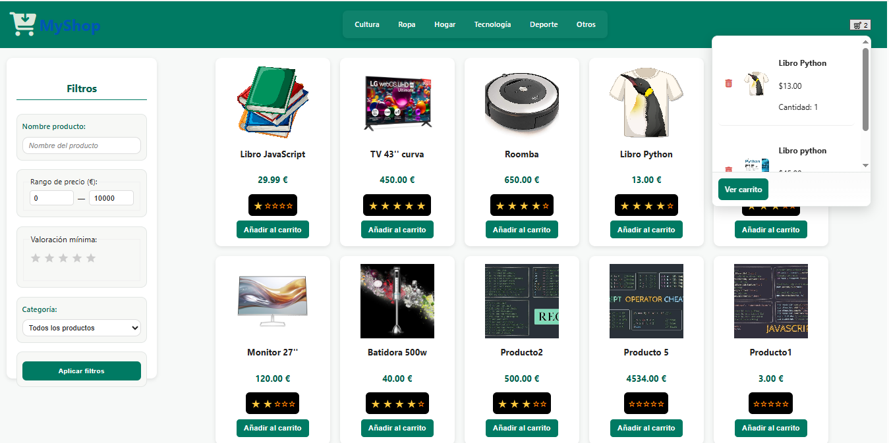
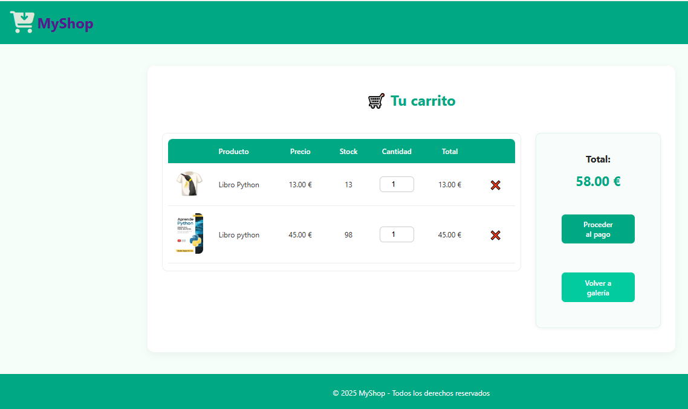
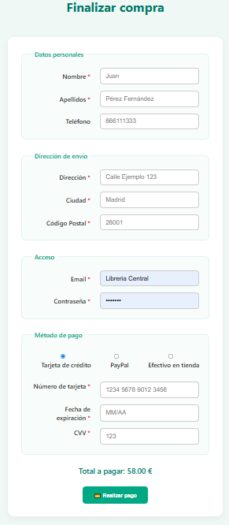
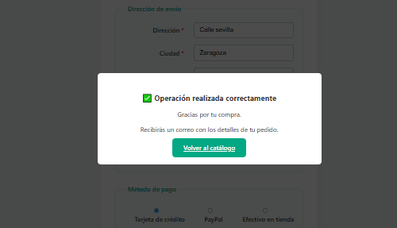
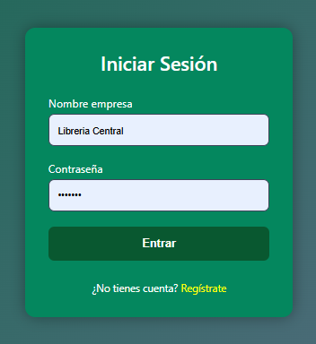
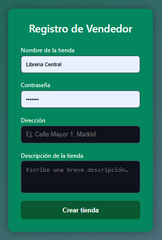
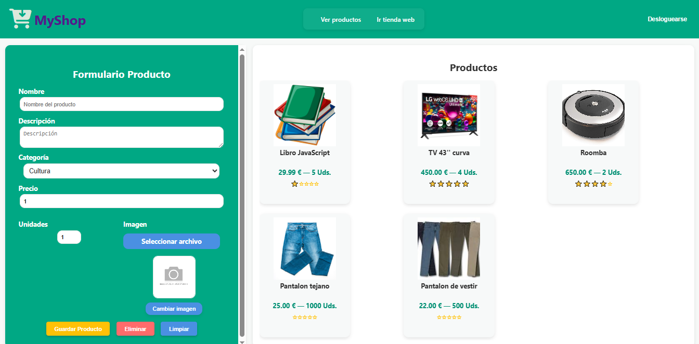

# MyShop (ecommerce)

**Descripción:** 
Proyecto básico de ecommerce para usuarios y vendedores

## Tecnologías
- Node.js + Express  
- Sistema plantillas EJS para vistas + CSS
- MySQL para base de datos  
- JavaScript (ES6 modules) en frontend  
- Multer para gestionar la subida de archivos

---

## Intención: 
- Catálogo de productos con filtros, galería y un carrito de compra.
- Con la posibilidad de realizar el pago (simulado).
- Integración de una sección para añadir productos por parte de los vendedores registrados.

---

## Características principales
- Render de productos en galería dinámica.
- Filtros (precio, categoría, estrellas y búsqueda con autocompletado).
- Carrito desplegable.
- Zona carrito para elegir cantidades de productos a comprar.
- Checkout/pago simulado con tarjeta, paypal o efectivo en tienda.
- Vendedores pueden loguearse , añadir/modificar productos o eliminarlos.
- Utilización de localStorage para persistencia de datos de loguin y carrito. 

## Flujo de compra
1. Navegar por el catálogo y añadir productos al carrito.
2. Revisar carrito y ajustar cantidades.
3. Ir a checkout y rellenar datos personales.
4. Seleccionar método de pago (tarjeta, PayPal o efectivo en tienda).
5. Confirmar compra y recibir mensaje de éxito.

---

## Navegación general
- **Inicio / catálogo:** `/`
- **Producto individual:** `/producto/:id`
- **Carrito:** `/cart`
- **Checkout:** `/checkout`
- **Login de usuario o vendedor:** `/login`
- **Panel de administración (solo vendedores):** `/admin`

## API Endpoints principales
- `POST /api/usuarios` → Registrar o reutilizar usuario (checkout)
- `POST /api/pedidos` → Crear pedido y actualizar stock
- `GET /api/productos` → Listado de productos
- `POST /api/productos` → Añadir producto (vendedor)
- `PUT /api/productos/:id` → Modificar producto (vendedor)
- `DELETE /api/productos/:id` → Eliminar producto (vendedor)

---

## Capturas de pantalla

### 1. Inicio / Catálogo de productos

### 2. Carrito de compra

### 3. Checkout / Pago

### 4. Confirmación de compra

### 5. Login de vendedor

### 6. Registro de vendedor

### 7. Panel de administración (solo vendedores)

---

## Ejecutar localmente
> Crear la base de datos con ExportDump20251104.sql (Estructura y datos)

1. Instalar dependencias:
   npm install
2. Variables de entorno (si aplica): crea `.env` según tu configuración (puerto, BD).
3. Levantar servidor:
   npm start
4. Abrir en el navegador:
   http://localhost:XXXX ( XXXX --> el puerto configurado)

---

## Licencia
MIT

## Realización
Oscar Plaza Portales
11/2025

> https://github.com/Oscar-pp/ecommerce.git